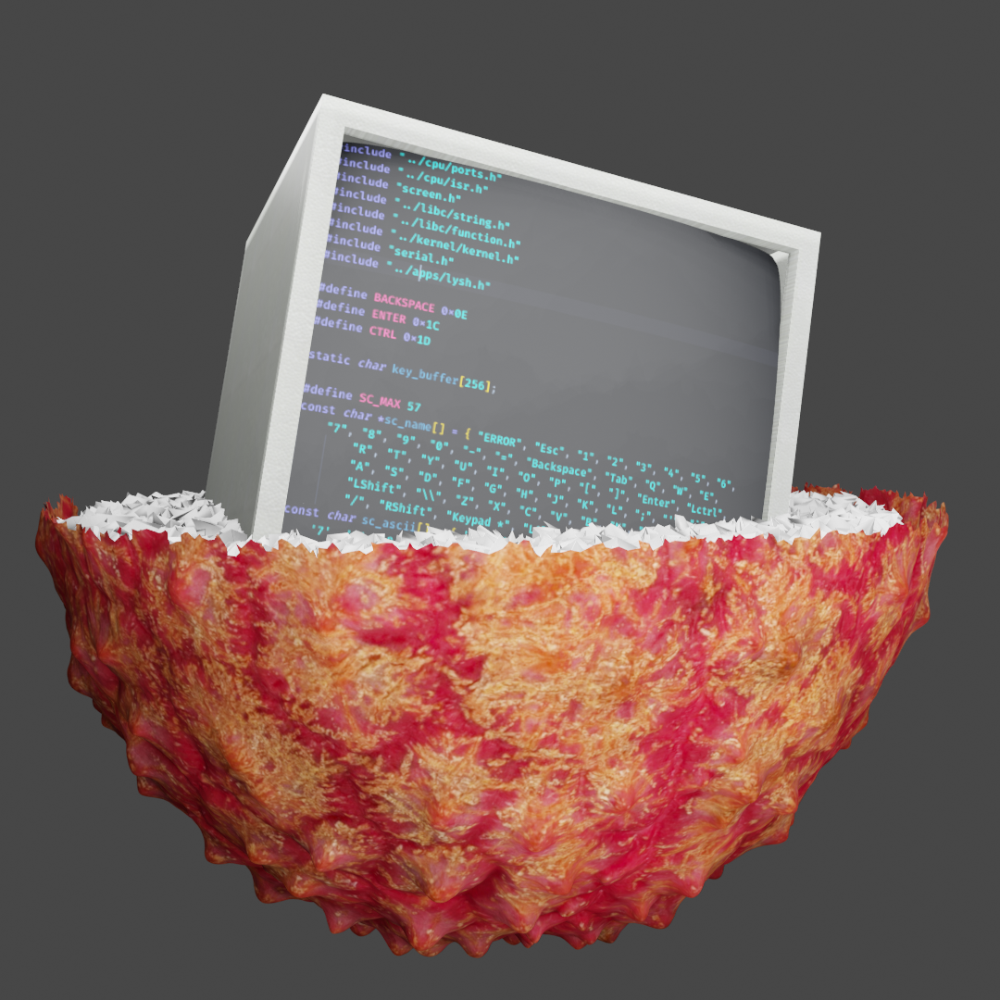

# Lychee

An improved version of hemimorphite made using https://github.com/cfenollosa/os-tutorial

How to Compile:
make

How to Run:
make run (will compile if make wasn't already run)

How to Run on Real Hardware:
It doesn't work on my test computer (Dell Optiplex 790).
It stops at "Loading kernel into memory." To get it working try changing the number of sectors loaded at line 30 of bootsect.asm
(mov dh, 48) with 48 being the sector amount.
